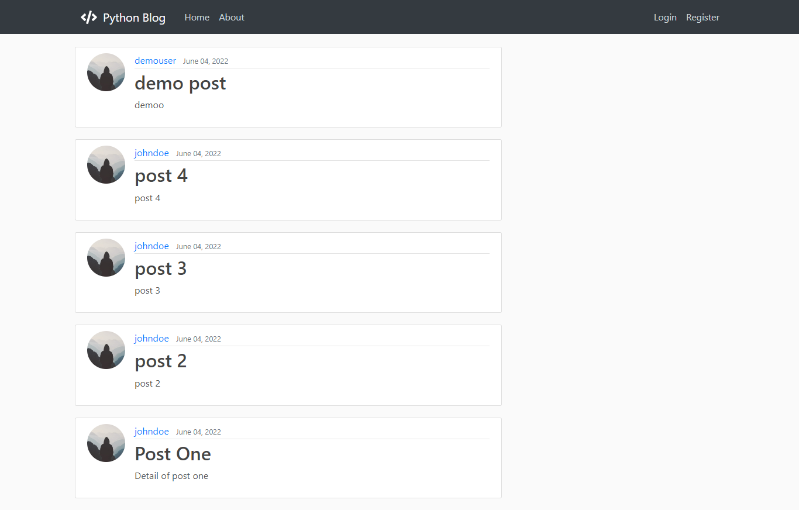

<h1 align="center">Blog Application</h1>

<div align="center">
  <h3>
    <a href="">
      Live
    </a>
    <span> | </span>
    <a href="https://github.com/sayyedulawwab/django-blog">
      Code
    </a>
    
  </h3>
</div>

A blog application made with python django framework. Users can create account and add new posts to the site and update and delete their posts. Users can add, edit and delete comments on posts

<details open>
  <summary>Table of Contents</summary>
  <ul>
    <li><a href="#built-with">Built With</a></li>
    <li><a href="#features">Features</a></li>
    <li><a href="#installation-and-usage">Installation and Usage</a></li>
    <li><a href="#contact">Contact</a></li>
  </ul>
</details>



### Built With

- [Django](https://www.djangoproject.com/)

## Features

- User authentication and authorization with password reset functionality
- CRUD functionality for posts
- CRUD functionality for comment system on posts


## Installation and Usage

1. Install python 3.9
2. Install pipenv:

```
pip install pipenv
```

3. Install dependencies:

```
pipenv install
```

4. Activate python environment:

```
pipenv shell
```

5. make migration files:

```
python manage.py makemigrations
```

6. migrate to database:

```
python manage.py migrate
```

7. Run the server:

```
python manage.py runserver
```

## Contact

- Twitter: [@sayyedulawwab](https://twitter.com/sayyedulawwab)
- LinkedIn [@sayyedulawwab](https://www.linkedin.com/in/sayyedulawwab/)
